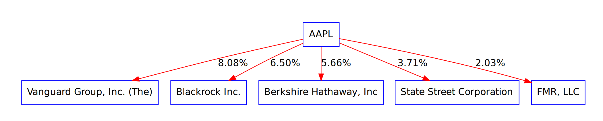

### check point
With tushare and yfinence, we fetch three companies' stock data between 2015-01-01 and 2022-12-30, each of them contains more than 1000 records.In order to reduce the requests to the api service, we cached these data as a csv file in local storage. In other words, we will ask for data from api service only when our file located on local storage missed.
Our data can be divided into three, AAPL, PingAn, AURA. And all of them conist of more than 1000 entries.A record consists of trade_date, open, high, low, close, pre_close, change, pct_chg, vol and amount.
When handling the stocks holders of a company, We use a tree structure to show the ownership structure of a company, which is helped by graphviz. Tree Image can be found in current directory.
Plans for future:
We will use a flask server as a backend, and vuejs as a front view. When showing diagraphs, we will utilize echarts to visualize our stocks data. Users can input a time range to visualize specific range of stocks data. If time permits, we will add as many charts as possible, such as Stock candlestick chart.
